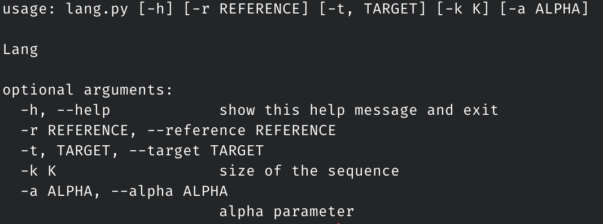
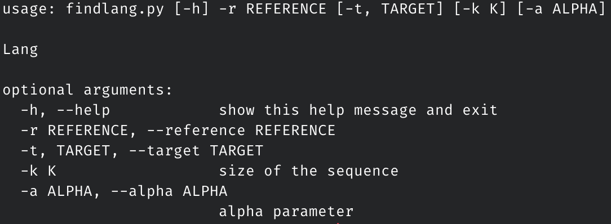
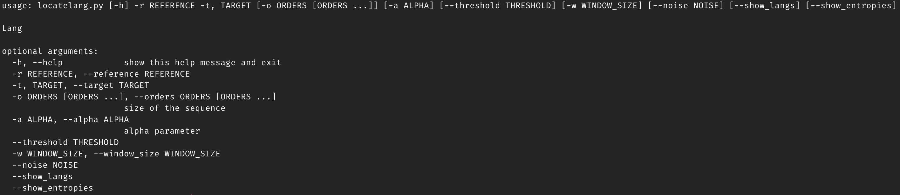

# TAI Second Assignment

Identifying the language a text is written on, is a problem that has been having attention for a while. Many approaches try to extract features from the text and then use them to identify the correspondent language. However, this problem can be seen as a special form of lossy data compression, allowing the use of compress algorithms to measure the similarity between texts.

The objective of this work was to approach the problem of determining the ”similarity” between a target text, t, and some reference texts, ri.

## Course
This project was developed under the [Algorithmic Theory of Information](https://www.ua.pt/en/uc/13643) course of [University of Aveiro](https://www.ua.pt/).

## Grade 
This project's grade was **18** out of 20.

## Authors

* [Bruno Bastos](https://github.com/BrunosBastos) - 93302
* [Eduardo Santos](https://github.com/eduardosantoshf) - 93107
* [Pedro bastos](https://github.com/bastos-01) - 93150

## Structure

### src/ 

Contains the source code of the project. To make sure nothing fails while runing the programs, it is recomended to run:

	$ pip install -r requirements.txt
	
### langs/

Contains the texts used in the programs. The folder `train/` has the reference texts and the folder `test/` has the texts to target in our programs.

### report/

Contains the assignment report.

## How to run

Inside the `src/` folder we can find:

* `charts.py` - module to make the graphic that compares the number of average bits between a reference and a target text.
* `utils.py` - module to make the graphic that shows the positions that each language starts in a multi-language target text.
* `fcm.py` - fcm module from last assignment.
* `lang.py` - compares 2 files and calculates the number of bits to encode the target text.
* `findlang.py` - using the lang module, predicts the language of a certain target text.
* `locatelang.py` - predicts the laguages and positions of each one in a multi-language file.

### lang.py

Usage example:
	
	$ python3 lang.py -r "../langs/train/english.utf8" -t "../langs/test/english.utf8"

Besides the reference and target text, you can also change the `alpha` and `k` parameters.

### findlang.py

Usage example:
	
	$ python3 findlang.py -r "../langs/train/" -t "../langs/test/english.utf8"

The reference option is required. Besides that, you can change the target text and the `alpha` and `k` parameters.

### locatelang.py

Usage example:
	
	$ python3 locatelang.py -r "../langs/train/" -t "../langs/test/test.txt" -w 3 -o 2 3 4

Reference and target options are required. You can also change the `orders` (k values), `alpha`, `threshold` (can be either 'mean', 'max', 'entropy' or a float value), `window size` and `noise reduction`. `show_langs` is an optional parameter to plot the graphic. 

